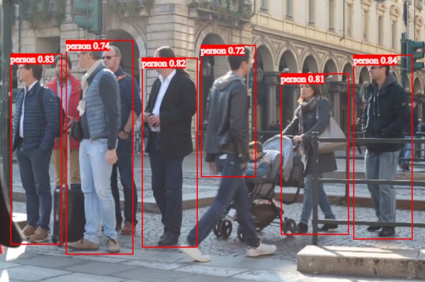

# Full-stack take-home AI test

<p align="center">
    
</p>

## Overview
This project is a full-stack application that showcases an AI object detection model's predictions through a user-friendly dashboard. The backend is built with Flask in Python, serving predictions from an ONNX model. The frontend is developed using React and Fabric.js, providing an interactive interface to display the detected objects.

## The Task
The task is to create a frontend that interfaces with the backend and plays a video file, sends each frame to the API for prediction, and then shows the results for that frame on the frontend. 
The interface should have a video player, a configuration area for model settings to be configured (such as IoU and Confidence Level), a preview area where each bounding box returned by the model is drawn on top of the predicted frame (using Fabric.JS), and a table for the last 10 prediction results. 

On the backend, each inference result should be saved to a PostgreSQL database. Feel free to add or modify endpoints.

## Architecture

- **Backend:** Python >=3.8 + Flask (for the AI model's predictions) + ONNX
- **Frontend:** React + Fabric.js + Typescript + (tailwind & daisyui)
- **Database:** PostgreSQL (to store user inputs and model predictions)

## API Endpoints

#### Ping:
- Endpoint: `/ping`
- Method: GET
- Description: returns pong. Usefull to see if the server rest api is operational.

#### Detect Objects:
- Endpoint: `/detect`
- Method: POST
- Description: Receive a json that represent a request for image analyze, returns the detection results and store it on the database.

- **Example 1:**
	- request:
	```json
	{
		"file_time": -1,
		"file_name": "bus.png",
		"image_info": "/app/test/bus.jpg",
		"confidence": 0.7,
		"iou": 0.5,
		"format": "path"
	}
	```
	- response:
	```json
	[
		{
			"box": {"height": 503, "left": 50, "top": 400, "width": 195},
			"class_name": "person",
			"confidence": 0.9132577180862427
		},
		{
			"box": {"height": 489, "left": 668, "top": 391, "width": 140},
			"class_name": "person",
			"confidence": 0.9127665758132935
		},
		{
			"box": {"height": 515,  "left": 3, "top": 228,  "width": 805},
			"class_name": "bus",
			"confidence": 0.9017127752304077
		},
		{
			"box": {"height": 452, "left": 223,  "top": 407, "width": 121},
			"class_name": "person",
			"confidence": 0.8749434351921082
		}
	]
	```
- **Example 2:**
	- request:
	```json
	{
		"file_time": 0,
		"file_name": "demo.jpg",
		"image_info": "https://storage.googleapis.com/sfr-vision-language-research/BLIP/demo.jpg",
		"confidence": 0.7,
		"iou": 0.5,
		"format": "path"
	}
	```
	- response:
	```json
	[
		{
			"box": {"height": 562, "left": 924, "top": 522, "width": 572},
			"class_name": "person",
			"confidence": 0.925483226776123
		},
		{
			"box": {"height": 623, "left": 456, "top": 585, "width": 733},
			"class_name": "dog",
			"confidence": 0.8675347566604614
		}
	]
	```

#### Health Check:
  - Endpoint: `/model_check`
  - Method: GET
  - Description: Checks if the model is loaded and returns the status.

#### Load Model:
  - Endpoint: `/load_model`
  - Method: POST
  - Description: Loads a specified `model_name` for object detection. One of `yolov8n` (nano: faster, less accurate) or `yolov8s` (small: a bit slower and more accurate).

#### Models List:
  - Endpoint: `/models_list`
  - Method: GET
  - Return an array of strings contening all avaliable models.